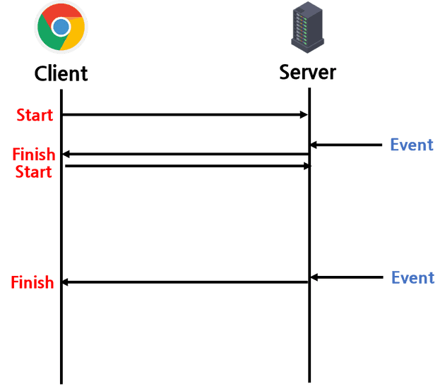

# spring boot Server-Sent Events(SSE) 샘플 예제

## 이론
HTTP 프로토콜의 주요 특징은 비연결성이다.

서버가 데이터를 전송하고 싶어도, 서버는 특정 클라이언트와 지속적으로 연결이 되어있지 않기 때문에, 실시간 댓글, 실시간 알림, 실시간 주식 가격 등 실시간 으로 동작하는 기능을 구현할 때는 SSE와 같은 기술을 사용해야 한다.

### 대표적인 실시간 통신 기능 구현 방법
 - 웹 소켓, 폴링, 긴 폴링, 서비스 워커, SSE

1. Polling
- 클라이언트가 주기적으로 서버에 요청을 보내는 방식

- 장점
  - 구현이 단순하다.
- 단점
  - 계속 요청을 해야 한다는 점에서 리소스 낭비 발생
- 결론
  - 요청하는 데 부담이 적고, 요청 주기를 넉넉하게 잡아도 될 정도로 실시간성이 중요하지 않고, 데이터 갱신이 특정한 주기를 갖는 서비스에 적합하다.

2. Long Polling
- Polling에 비해 유지 시간을 조금 더 길게 갖는다.
- 요청을 보내고 서버에서 변경이 일어날때까지 대기한다.

- 장점
  - Connection이 연결된 동안 이벤트 발생을 실시간으로 감지할 수 잇다.
  - 지속적으로 요청을 보내지 않으므로 부담이 덜하다.
- 단점
  - 유지 시간을 짧게 설정한다면 Polling과 차이가 없다.
  - 지속적으로 연결되어 있기 때문에 다수의 클라이언트에게 동시에 이벤트가 발생할 경우 순간적 부담이 급증한다.
- 결론
  - 실시간 전달이 중요한데 상태가 빈번하게 갱신되진 않을 때 적합하다.

3. WebSocket(웹 소켓)
- 양방향으로 데이터를 주고받을 수 있다.
- 최초 접속은 HTTP 요청을 통한 handshakiing으로 이루어짐.

- 장점
  - HTTP와 달리 지속적으로 Connection을 지속하기 때문에 연결에 드는 불필요한 비용을 제거할 수 있다.
  - 용량이 큰 HTTP 헤더를 최초 접속 시에만 보내기 때문에 리소스를 절약할 수 있다.
  - 웹 소켓 포트에 접속해있는 모든 클라이언트에 이벤트 방식으로 응답할 수 있다.

4. Server-Sent-Events(SSE)
- Client가 서버와 한 번 연결을 맺고 나면 Server에서 이벤트가 발생할 때마다 데이터를 전송받는 단방향 통신 방식

- 장점
  - HTTP 프로토콜만으로 사용할 수 있어 구현이 용이하다.
  - 접속에 문제가 있는 경우 자동으로 재연결을 시도한다.
- 단점
  - 클라이언트가 접속을 close해도 서버에서 감지하기가 어렵다.

### SSE의 통신 과정
1. Client 측 - SSE Subscribe 요청
   - 클라이언트가 서버의 이벤트를 구독하기 위한 요청을 전송
   - 이벤트의 mediaType은 text/event-stream이 표준 스펙으로 정해져있음.

2. Server 측 - Subscription에 대한 응답
   - Response의 mediaType은 text/event-stream.
   - 서버는 동적으로 생성된 컨텐츠를 스트리밍하기 때문에 본문의 크기를 미리 알 수 없으므로 Transfer-Encoding 헤더 값을 chunked로 설정해야 한다.

3. Server 측 - 이벤트 생성 및 전송
   - 자신을 구독하고 있는 클라이언트에게 비동기적으로 데이터를 전송할 수 있다.
   - 데이터는 utf-8로 인코딩된 텍스트 데이터만 가능
   - 각각의 이벤트는 한 개 이상의 name:value로 구성된다.

### Spring에서 제공하는 SSE 서포팅 기술
- SseEmitter

### 동작 순서
1. 클라이언트에서 SSE 연결 요청을 보낸다.
2. 서버에서 클라이언트와 매핑되는 SSE 통신 객체(SseEmitter)를 만든다.
3. 서버에서 이벤트가 발생하면 해당 객체를 통해 클라이언트로 데이터를 전송한다.

### 참고 자료
- https://amaran-th.github.io/Spring/%5BSpring%5D%20Server-Sent%20Events(SSE)
- https://zero-zae.tistory.com/252
